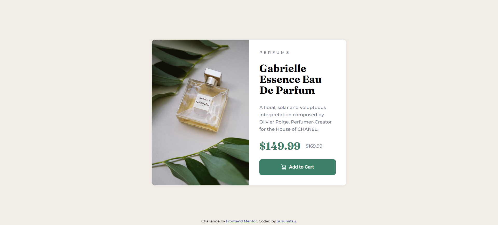
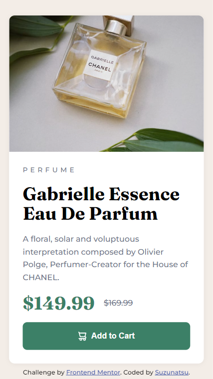

# Frontend Mentor - Product preview card component solution

This is a solution to the [Product preview card component challenge on Frontend Mentor](https://www.frontendmentor.io/challenges/product-preview-card-component-GO7UmttRfa). Frontend Mentor challenges help you improve your coding skills by building realistic projects. 

## Table of contents

- [Frontend Mentor - Product preview card component solution](#frontend-mentor---product-preview-card-component-solution)
  - [Table of contents](#table-of-contents)
  - [Overview](#overview)
    - [The challenge](#the-challenge)
    - [Screenshot](#screenshot)
    - [Links](#links)
  - [My process](#my-process)
    - [Built with](#built-with)
    - [What I learned](#what-i-learned)
  - [Author](#author)

**Note: Delete this note and update the table of contents based on what sections you keep.**

## Overview

### The challenge

Users should be able to:

- View the optimal layout depending on their device's screen size
- See hover and focus states for interactive elements

### Screenshot

Desktop



Mobile




### Links

- Solution URL: [Add solution URL here](https://github.com/st0272/fm-product-preview-card-component)
- Live Site URL: [Add live site URL here](https://st0272.github.io/fm-product-preview-card-component/)

## My process

### Built with

- Semantic HTML5 markup
- CSS custom properties
- Flexbox
- CSS Grid
- Mobile-first workflow

### What I learned

Responsive image with `picture` and `source` element

```html
<picture class="card__image">
  <source
    srcset="images/image-product-desktop.jpg"
    media="(min-width: 600px)"
    width="300"
    height="450"
  />
  
</picture>
```

Character to uppercase

```css
.card__category {
  text-transform: uppercase;
}
```

## Author

- Website - [Suzunatsu Website](https://www.suzunatsu.com?utm_source=gh)
- Frontend Mentor - [@st0272](https://www.frontendmentor.io/profile/st0272)
- Twitter - [@suzuantsu_](https://www.twitter.com/suzuantsu_)